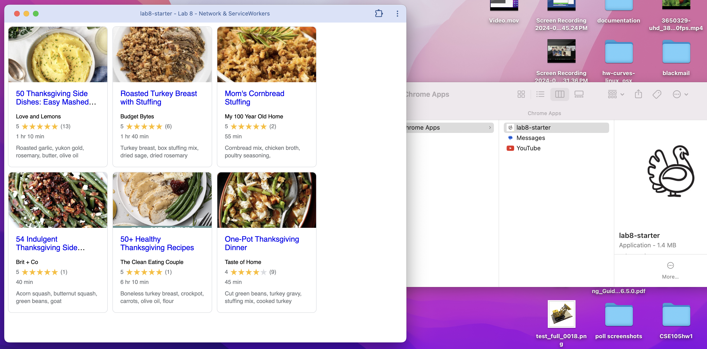

# Lab8-Starter
Website: [https://dyc-github.github.io/Lab8-Starter/](https://dyc-github.github.io/Lab8-Starter/)

Graceful Degradation: Service workers are a tool that aid in graceful degradation. They allow for essential functionality to continue working even if the the network fails, therefore contributing to a graceful response to missing technologies.  However, there are some cases where we want to fail completely in which case a result from the Service Worker may actually be misleading. 

